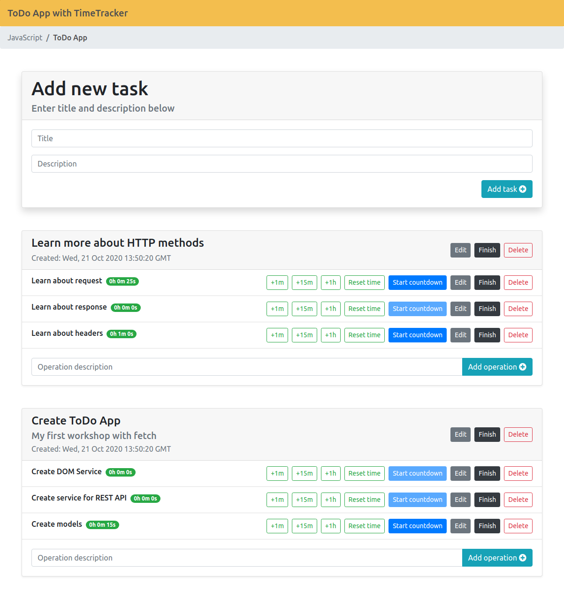

# ToDoApp
This app allows users to manage tasks and operations that are stored on a remote server. Data between user and DB is transferred in JSONs using REST API with simple CRUD support (GET, PUT, POST, DELETE).

Access to API: https://todo-api.coderslab.pl

In order to use API user needs to generate personal key that can be obtained on: https://todo-api.coderslab.pl/apikey/create

Personal key must be sent in the header ("Authorization": "API_KEY") for each request.

# Content
What you can do:
- add/finish/edit/delete tasks
- add new operation to task
- finish/edit/delete operation
- add time to operation
- start countdown of operation

# Main Page

# ToDoApp API 
|      Address     |      Method     |      Description      | Data structure |
|----------------|-----------------|----------------|-----------------------------|
| `/api/tasks`   |    GET          | Getting all tasks  |  |
| `/api/tasks`   |    POST         | Adding new task |  {title: "", description: "", status: "", addedDate: ""} |
| `/api/tasks/:id`   |    PUT         | Updating task |  {title: "", description: "", status: "", addedDate: ""} |
| `/api/tasks/:id`   |    DELETE         | Deleting task |   |
| `/api/tasks/:id/operations`   |    GET          | Getting task with all operations |  |
| `/api/tasks/:id/operations`   |    POST          | Adding operation to task |  {description: "", timeSpent: 0, addedDate: ""}  |
| `/api/operations/:id`   |    GET          | Getting operation |  |
| `/api/operations/:id`   |    PUT          | Updating operation |  {description: "", timeSpent: 0, addedDate: ""} |
| `/api/operations/:id`   |    DELETE          | Deleting operation |  |

# Design patterns used:
- REST API
- async/await

# Technologies used: 
- JavaScript
- HTML, CSS
- Bootstrap 4
- JSON

# Copyright

